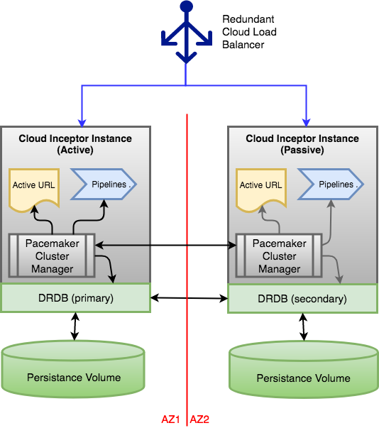

# Cloud Builder Automation Appliance

## Overview

This project provide templates for building a secured inception environment for automating deployments using [Terraform](https://www.terraform.io/) templates and [Concourse](https://concourse-ci.org/) pipelines. The Terraform templates provided in the [`modules`](modules) folder enable you to pave an inception environment with a bastion host that provides a secure mechanism to access the Virtual Private Cloud network via VPN. This host also doubles as the inception Concourse automation host which can run pipelines to build distributed cloud infrastructure.

test

## Cloud Inceptor Services

The cloud inceptor image can configure one or more of the services shown below. These services provide a framework for bootstrapping a deployment with automation pipelines for both day-1 and day-2 operations. 

## Cloud Inceptor Redundancy

If you want to create a redundant inceptor deployment that is resilient to data center availability zone outages then you will need to configure the inceptor clustering capabilities shown below. 

Redundancy is only required if you need to achive high-availability of the automation services. The appliance can always be rebuilt via the Terraform state of the deployment in an idempotent manner.
