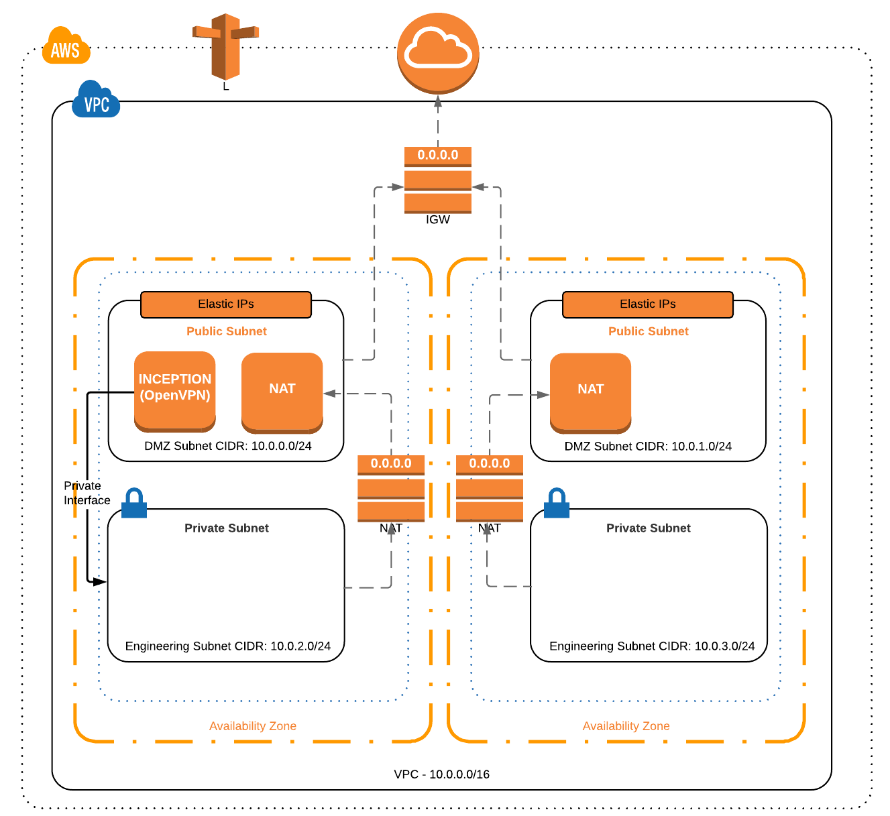

# Paves an AWS VDC

This Terraform module paves an AWS VDC with the inception VM acting as a bastion host as well as a deployment automation service to setup other services within the VDC via Concourse. It sets up the following initial VDC architecture.

